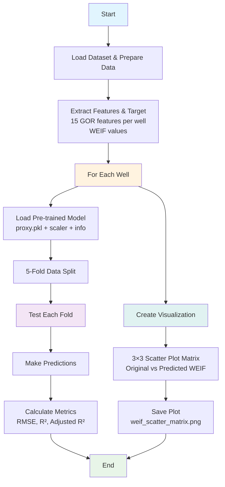

# Cross-Validation Analysis Workflow

This document explains how the `02.3_cross_validation_analysis.py` script works.

## Overview

The script evaluates pre-trained proxy models for reservoir optimization by testing them on different data splits. While called "cross-validation," it's more accurately described as "holdout testing" since it doesn't retrain models on each fold.

## Workflow Diagram

## Key Components

### 1. Data Loading & Preparation
- **Dataset**: `otm_gor_icv5_clean.csv`
- **Features**: 15 GOR features per well (5 zones × 3 segments)
- **Target**: WEIF values for each well
- **Preprocessing**: Normalization, NaN removal, shuffling

### 2. Model Loading
- **Source**: `./02_output_proxy_models_bkp/{Well}/BEST_REGRESSOR/`
- **Files**: `proxy.pkl`, `y_scaler.pkl`, `INFO.txt`
- **Model Type**: Determined from INFO.txt (e.g., GTB, GPR, KNN)

### 3. Evaluation Process
- **Method**: 5-fold data splitting (KFold)
- **Testing**: Use pre-trained models on test data only
- **No Training**: Models are not retrained on each fold
- **Metrics**: RMSE, R², Adjusted R²

### 4. Visualization
- **Output**: 3×3 scatter plot matrix
- **Content**: Original vs Predicted WEIF values
- **Normalization**: 0-1 range for better comparison
- **Format**: High-resolution PNG (300 DPI)

## Wells Analyzed

| Well | Model Type | Performance Range (R²) |
|------|------------|------------------------|
| PRK014 | GTB | 0.82 - 0.95 |
| PRK028 | GTB | 0.72 - 0.88 |
| PRK045 | GTB | 0.47 - 0.65 |
| PRK052 | GTB | 0.75 - 0.89 |
| PRK060 | GTB | 0.72 - 0.79 |
| PRK061 | GTB | 0.45 - 0.75 |
| PRK083 | GTB | 0.42 - 0.68 |
| PRK084 | GTB | 0.66 - 0.74 |
| PRK085 | GTB | 0.72 - 0.88 |

## Important Notes

⚠️ **Terminology Clarification**: This is not true cross-validation since models are not retrained on each fold. It's more accurately described as "model evaluation on data splits" or "holdout testing."

✅ **What It Does**: Tests how well pre-trained models generalize to unseen data splits.

✅ **What It Doesn't Do**: Retrain models or perform true cross-validation.

## Output Files

- **Main Output**: `./02.3_cross_validation_analysis/weif_scatter_matrix.png`
- **Console Output**: Detailed metrics for each well and fold
- **Execution Time**: Typically under 1 second for the full analysis
